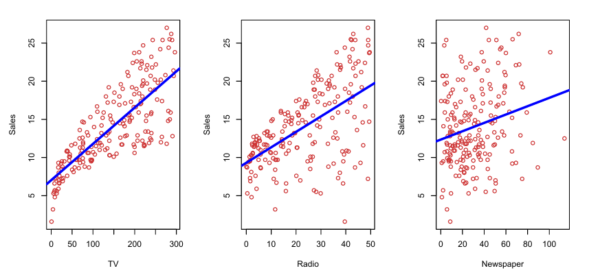

# Cap 2: Statistical Learning

Fomos contratados por um cliente para investigar a relação entre:
- As vendas de seus produtos (em 200 mercados diferentes)
- O orçamento que eles disponibiliazm para comerciais (TV, radio e jornal)

O cliente não consegue aumentar as vendas por mágica, mas ele pode alterar os orçamentos.

Nossa missão é construir um **modelo** que pode ser utilizado para **prever** as vendas com base nos três orçamntos de comerciais.

## Input variables

> Obs: Os inputs também são chamados de *predictors, independent variables, features* ou *variables*.
> Os outputs são chamados de *response* ou *dependent variables*

    > Isso faz sentido, já que percebemos que as vendas (o resultado) depende dos orçamentos (dependent variables) enquanto os orçamentos, podemos escolher livremente (independent variables)

Os inputs dos modelos são normalmente denotados por X.

- X1: TV budget
- X2: Radio budget
- X3: Jornal budget

## Ideia:

Temos o valor das vendas nos ultimos anos dessa empresa, assim como o orçamento dos comerciais em cada veículo de comunicação.

Com isso, conseguimos notar uma certa **relação** entre os budgets e as vendas (relação entre o input e a variável dependente). Parece que quanto mais comerciais fazemos, mais vendas acontecem...

$Y = f(X) + \epsilon$

f é, por enquanto, uma função desconhecida de X ($X_1, X_2, X_3$), que são as variáveis independentes. $\epsilon$ é o erro, que representa a diferença entre o valor real e o valor previsto pelo modelo.

    > No gráfico conseguimos ver a função f em azul e os valores reais em vermelho. O erro é a diferença entre os dois.

A grande qustão é: **como podemos estimar a função f?**

### Em resumo, Statistical Learning é o conjunto de métodos para estimar a função f, que relaciona os inputs (X) com o output (Y).

A acurácia, precisão, da precisão de Y depende de duas coisas:
1. **reducible error**
2. **irreducible error**

    > No geral, não encontramos um f perfeito, ainda vai existir o $\epsilon$ (epsilon), que é o **erro irredutível**.

    > Ele é como se fosse a variação natural do Y. O tempo em que a amostra foi medida, os subprodutos utilizados no dia se estamos medindo a eficacia de um medicamento, o clima, a economia, etc. Tudo isso influencia o Y e não conseguimos controlar.
### Prediction

Sobre prever valores de Y

$$
E(Y-\hat{Y})^2=E\bigl[f(X)+\epsilon-\hat{f}(X)\bigr]^2
=\underbrace{\bigl(f(X)-\hat{f}(X)\bigr)^2}_{\text{Reducible}}+\underbrace{\operatorname{Var}(\epsilon)}_{\text{Irreducible}}
$$

Como a ideia é estimar f, focamos em reduzir o erro reductível!

### Inference

Sobre entender a relação entre X e Y.

    > Coisas como: qual variável interfere mais nas vendas? Qual é a relação entre o orçamento de TV e as vendas? E entre o orçamento de rádio e as vendas?...

Em um modelo para precificar casas com base em variáveis como tamanho, perto de um rio, numero de quartos, escolas, etc.

- O quanto o preço aumenta se a casa for perto de um rio? **problema de inferência**

- Minha casa está avaliada corretamente? **problema de predição**

Um modelo pode dizer bem o quanto o preço aumenta conforme o numero de quartos, mas não consegue dizer se a casa está avaliada corretamente.

Outro modelo pode utilizar tecnicas sofisticadas (como modelos não lineares) para prever o preço da casa, mas não consegue prever uma avaliação correta do preço da casa.

    > Sendo assim, um unico modelo nunca é adequado para resolver os dois problemas.

## Como estimar f?

Existem técnicas lineares e não lineares para estimar f.

**training data**: conjunto de dados que utilizamos para estimar f.

    > Sempre utilizamos um conjunto de n observações para treinar o modelo a como estimar f. Esse conjunto é chamado de training data.

Queremos encontrar uma função $\hat{f}$ em que $Y \approx \hat{f}(X)$, ou seja, queremos que o modelo consiga prever Y com base em X.

Existem duas abordagens para estimar f:

### Parametric Methods

**Reduzir o problema de estimar f para um problema de estimar um conjunto de parâmetros.**

1. Primeiro fazemos uma suposição sobre a forma da função f, como por exemplo, que ela é linear.

Funções lineares possuem a forma:

$f(X) = \beta_0 + \beta_1X_1 + \beta_2X_2 + ... + \beta_pX_p$

Elas são mais fáceis de se trabalhar. Precisamos apenas estimar os parâmetros $\beta_0, \beta_1, ..., \beta_p$.

2. Depois que o modelo foi selecionado, precisamos de um processo para usar o *training data* para estimar os parâmetros do modelo.

    > O modelo linear é um exemplo de método paramétrico. Ele é simples, mas pode não ser adequado para todos os problemas.

Existem vários métodos para estimar os parâmetros que vão ser discutidos no livro...

    Vale lembrar que dificilmente chegaremos a uma predição perfeita utilizando métodos paramétricos e modelos lineares. A função f pode ser muito complexa para ser representada por uma função linear.
    
    Mas com poucas observações, esse método pode ser o melhor que conseguimos.

### Non-Parametric Methods

Não temos uma forma definida para a função f, ou seja, não fazemos suposições sobre a forma da função f (primeiro passo na abordagem paramétrica).

- Mais flexível
- Mais difícil de estimar, pois precisa de mais dados.

Em metodos paramétricos, há o risco de a função f não ser realmente linear. Nesse caso nossa predição será ruim.

Em métodos não paramétricos, não fazemos suposições sobre a forma da função f, então não temos esse risco. Conseguimos capturar relações mais complexas entre X e Y.

    > O problema é que métodos não paramétricos precisam de mais dados para estimar f com precisão. Se temos poucos dados, o método paramétrico pode ser melhor.